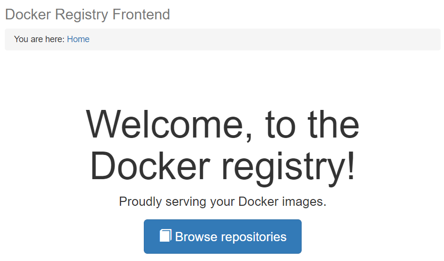
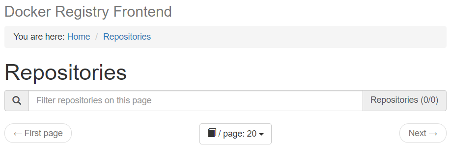

@title[Introduction]
# Offline <span style="color: #e49436">Docker</span>

#### How to use docker for (almost) continuous delivery to an offline environment.*
<br>
<br>
<span style="color: #bbb; font-size: 80%">[ Docker, Compose, Linux, Windows ]</span>

---

#### No more <span style="color: gray">"We target Windows, so we can't use Docker."</span>
#### No more <span style="color: gray">"We are on private networks, so no benefit from Docker."</span>
<br>
#### Just <span style="color: #e49436">docker-compose build</span>.
#### Then <span style="color: #e49436">docker-compose push</span>.

---

@title[Step 1. Build & Package]

### <span style="color: #e49436">STEP 1. Build & Package</span>
<br>

```shell
docker-compose up -d registry ui
docker-compose build
docker-compose push
```

@[1](Start local Docker Registry (on `:5000`, Web UI at [:8080](http://localhost:8080)))
@[2](Build Docker images (Tag to `localhost:5000`. Hint: Use [multi-stage builds](https://docs.docker.com/engine/userguide/eng-image/multistage-build/)))
@[3](Push built images to local registry)

---

Fire up the registry frontend on [http://localhost:8080](http://localhost:8080) and watch your built images.

---

### Docker Registry UI Welcome
<br>



---

### Empty before push
<br>



---

### See docker images
<br>


---
@title[Step 2. Export]

### <span style="color: #e49436">STEP 2. Export</span>
<br>

Export docker images

```shell
docker-compose run export
```

@[1](Export volume container `docker_images`.)

---
@title[Step 3. Ship It!]

### <span style="color: #e49436">STEP 2. Ship It!*</span>
<br>


<span style="color: #bbb; font-size: 80%">*Not our business here.</span>

---
@title[Step 4. Import again]

At the customer site, create & import the registry volume container

```shell
docker-compose run import
```

@[1](Create & import volume container `docker_images`.)

---
@title[Step 5. Run]

Finally, start up the registry and you're good to go

```shell
docker-compose up -d registry ui
```

@[1](Runs a standard registry with the volume container linked.)

---

#### View The <a target="_blank" href="https://github.com/awesome-inc/docker-deploy-offline">Code</a>
