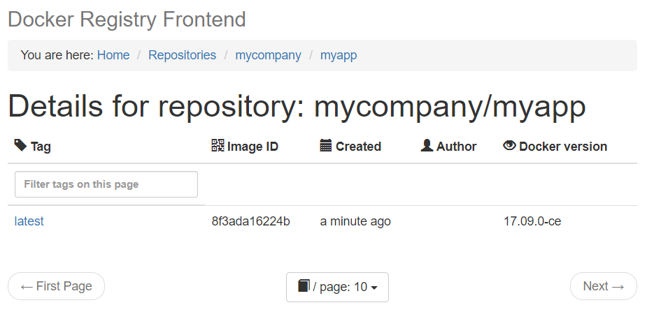

@title[Introduction]
## Offline <span style="color: #e49436">Docker</span>

#### How to use docker for (almost) continuous delivery to an offline environment.*
<br>
<br>
<span style="color: #bbb; font-size: 80%">[ Docker, Compose, Linux, Windows ]</span>

---

### <span style="color: #e49436">Initial Situation</span>

- Apps built with Docker |
- Orchestrated with docker-compose |

---

### <span style="color: #e49436">Production Environment</span>

- disconnected, | 
- remote or |
- just inaccessible. |
- How to deploy? |

---

# Demo

+++

@title[Step 1. Build & Push]

### <span style="color: #e49436">STEP 1. Build & Push</span>
<br>

```console
$ docker-compose up -d registry ui
$ docker-compose build
$ docker-compose push
```

@[1](Start local Docker registry (on `:5000`, Web UI at [:8080](http://localhost:8080)))
@[2](Build all apps (...tag to `localhost:5000`))
@[3](Push built images to registry)

+++

Registry frontend on [:8080](http://localhost:8080)



+++
@title[Step 2. Export]

### <span style="color: #e49436">STEP 2. Export</span>
<br>

```console
$ docker-compose run export
```

@[1](Export volume `docker_images -> ./data/registry.bz2`.)

+++
@title[Step 3. Ship It!]

### <span style="color: #e49436">STEP 3. Ship It!*</span>
<br>


<span style="color: #bbb; font-size: 80%">*Not our business here.</span>

+++
@title[Step 4. Import & Run]

### <span style="color: #e49436">STEP 4. Import & Run</span>
<br>

```console
$ docker-compose run import
$ docker-compose up -d registry ui
$ docker run [registry:5000]/mycompany/myapp:latest
```

@[1](Import volume `./data/registry.bz2 -> docker_images`)
@[2](Start registry)
@[3](Run images)

---

### Ok, got it! How to apply to my project?

+++?code=docker-compose.yml&lang=yml

In your `docker-compose.yml`:

@[5](Tag images to local registry `localhost:5000`)

+++?code=docker-compose.override.yml&lang=yml

Add this [docker-compose.override.yml](https://github.com/awesome-inc/docker-deploy-offline/blob/master/docker-compose.override.yml) for:

@[11-13](Docker registry)
@[24-25](Web UI for registry)
@[43-45,47-49](Export & Import)
@[51-52](Docker volume for registry images)

- That's it! |

---

### View The <a target="_blank" href="https://github.com/awesome-inc/docker-deploy-offline">Code</a>
